# ARSW Lab #1 — Concurrencia en Java 21

Escuela Colombiana de Ingeniería – Arquitecturas de Software
Laboratorio de programación concurrente: wait/notify, condiciones de carrera, sincronización y colecciones seguras.

---

## Requisitos

- JDK 21 (Temurin recomendado)
- Maven 3.9+
- SO: Windows, macOS o Linux

---

## Cómo ejecutar

Parte 1 — PrimeFinder: abrir `src/main/java/primefinder/Main.java` en el IDE y darle Run.

Parte 2 — Snake Race:

```bash
cd Lab_1_ARSW_JuanG
mvn clean verify
mvn -q -DskipTests exec:java -Dsnakes=5
```

En Snake, `-Dsnakes=N` inicia el juego con N serpientes. Los controles son flechas para la serpiente 0, WASD para la serpiente 1, y espacio o botón Pausar para pausar.

---

## Parte 1 — PrimeFinder: wait/notify en un programa multi-hilo

### Descripción

El programa busca números primos entre 0 y 30.000.000 usando 3 hilos trabajadores, cada uno cubriendo un tercio del rango. Cada segundo el programa pausa todos los hilos, muestra cuántos primos se han encontrado hasta ese momento y espera a que el usuario presione ENTER para continuar. Con pausas de 1 segundo se pueden ver los conteos crecer progresivamente, por ejemplo 600.000, luego 1.200.000, hasta llegar al total de 1.857.859 primos cuando todos los hilos terminan.

### Reporte de laboratorio — Parte 1

Mediante wait, notify y synchronized es posible pausar los hilos trabajadores y tras mostrar la cantidad de números primos encontrados hasta ese momento, reanudarlos con notifyAll.

Cada hilo trabajador llama checkPause() antes de revisar cada número. Si el juego está pausado, el hilo llama wait() y se queda dormido sin consumir CPU hasta que alguien lo despierte. Synchronized nos ayuda a poner un bloqueo para que los hilos no se interrumpan entre sí cuando entran a ese método.

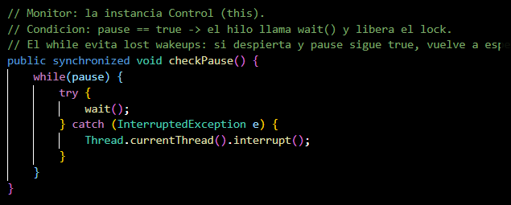

Cuando el usuario presiona ENTER, se llama resumeThreads() que pone pause en false y llama notifyAll(), despertando a todos los hilos para que continúen desde donde se quedaron.

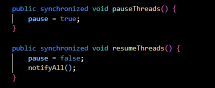

El programa usa scanner para esperar que el usuario presione ENTER antes de reanudar. Con pausas de 1 segundo se pueden ver los conteos crecer cada vez que se presiona ENTER, hasta llegar al total de 1.857.859 primos.

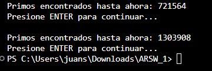

---

## Parte 2 — Snake Race: concurrencia con hilos virtuales

### Reglas del juego

- N serpientes corren de forma autónoma, cada una en su propio hilo virtual.
- Ratones (círculo negro): al comer uno la serpiente crece y aparece un nuevo obstáculo.
- Obstáculos (naranja): si la cabeza entra en un obstáculo la serpiente rebota.
- Teletransportadores (flechas rojas): entrar por uno te saca por su par.
- Turbo (rayo negro): velocidad aumentada temporal.
- Si la cabeza de una serpiente choca con el cuerpo de otra, la que choca muere. Si se chocan cabeza con cabeza, las dos mueren.
- Movimiento con wrap-around: el tablero se repite en los bordes.

### Arquitectura

```
co.eci.snake
├─ app/             → Bootstrap (Main)
├─ core/            → Dominio: Board, Snake, Direction, Position, GameState
├─ core/engine/     → GameClock (ticks a 60 FPS con AtomicReference)
├─ concurrency/     → SnakeRunner (lógica autónoma por serpiente)
└─ ui/legacy/       → SnakeApp (Swing, grilla, botones)
```

### Reporte de laboratorio — Parte 2

#### Data races encontradas y su solución

El programa lanza N hilos virtuales, uno por serpiente, todos llamando métodos del tablero al mismo tiempo. Esto generó varias condiciones de carrera.

El primer problema estaba en el método step() de Board. Varias serpientes lo llamaban al mismo tiempo sin ningún control, y todas modificaban las mismas colecciones de ratones, obstáculos y turbos. Una serpiente podía estar borrando un ratón mientras otra lo estaba leyendo, lo que causaba resultados incorrectos. La solución fue marcar step() como synchronized, de modo que solo un hilo puede ejecutarlo a la vez.

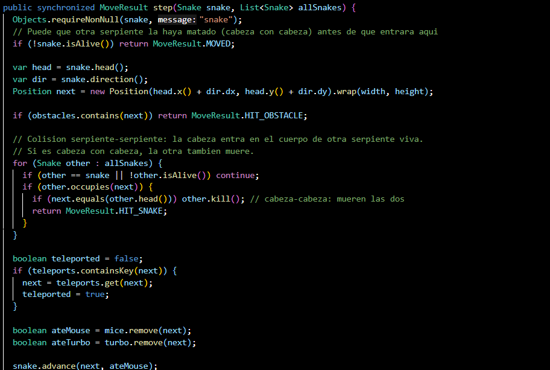

El segundo problema estaba en la clase Snake. El método snapshot() es llamado por el hilo de la UI para dibujar la serpiente, y advance() es llamado por el runner para moverla. Los dos acceden al mismo ArrayDeque al mismo tiempo. También head(), occupies() y turn() podían ser llamados desde hilos distintos sin ninguna coordinación. Se solucionó marcando todos esos métodos como synchronized sobre el mismo monitor de la serpiente, incluyendo turn() que tenía un check-then-act: leía la dirección, la verificaba y luego la cambiaba, pero esas tres cosas no eran atómicas.

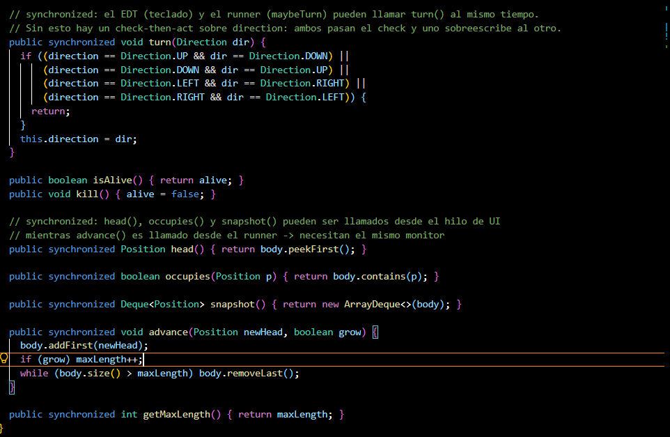

#### Colecciones mal usadas y cómo se protegieron

Las colecciones mice, obstacles, turbo y teleports son HashSet y HashMap normales. No son thread-safe y se modifican dentro de step() al mismo tiempo que la UI las lee para pintar el tablero. Se protegieron de dos formas: step() es synchronized para que solo un hilo las modifique a la vez, y los getters devuelven una copia nueva cada vez que la UI las necesita, así la UI nunca itera sobre la colección real mientras un runner la está cambiando.

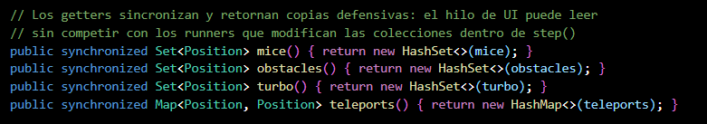

Para el registro de muertes se usa una lista separada llamada deathOrder. Esta lista recibe elementos desde los hilos de los runners cuando una serpiente muere, y la lee el hilo de la UI cuando se pausa el juego. Se creó con Collections.synchronizedList para que los accesos concurrentes sean seguros.

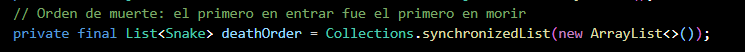

#### Esperas activas eliminadas y mecanismo utilizado

El mecanismo de pausa se implementó usando wait() y notifyAll() sobre un objeto pauseLock dentro de cada SnakeRunner. Cuando el juego se pausa, el hilo del runner entra a un bloque synchronized sobre ese objeto y llama wait(), quedando bloqueado sin consumir CPU. Cuando se reanuda, el método resume() llama notifyAll() sobre el mismo objeto y el hilo continúa. Esto evita completamente la espera activa.

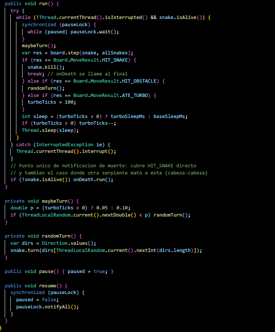

#### Regiones críticas definidas y justificación de su alcance mínimo

La región crítica principal es el método step() en Board. Ahí es donde ocurren todas las modificaciones al estado compartido del tablero: mover la serpiente, consumir ratones, agregar obstáculos, generar turbos. Se decidió que toda la operación de un paso sea atómica porque involucra múltiples lecturas y escrituras que deben verse como una sola acción.

El método randomEmpty() no necesita su propio synchronized porque solo se llama desde adentro de step(), que ya tiene el lock. En Snake, cada método que toca el cuerpo es synchronized individualmente sobre la instancia de la serpiente. El alcance es mínimo: solo se bloquea mientras se lee o escribe el cuerpo, no durante todo el tiempo que la serpiente está viva.

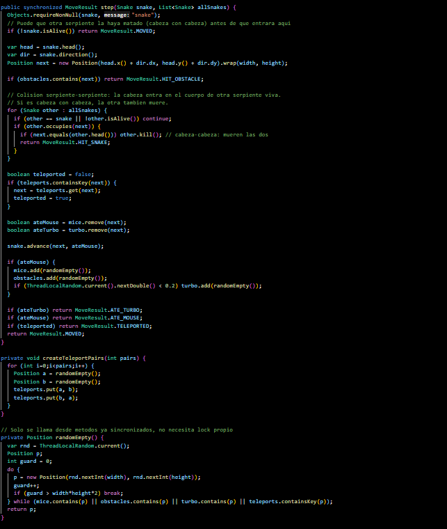

#### UI con Iniciar, Pausar, Reanudar y estadísticas

La interfaz tiene tres botones. Iniciar arranca los hilos de todas las serpientes y el reloj del juego. Pausar detiene tanto el reloj como todos los runners usando wait/notifyAll. Reanudar los vuelve a activar. Al pausar se muestra cuál es la serpiente viva más larga y cuál fue la primera en morir.

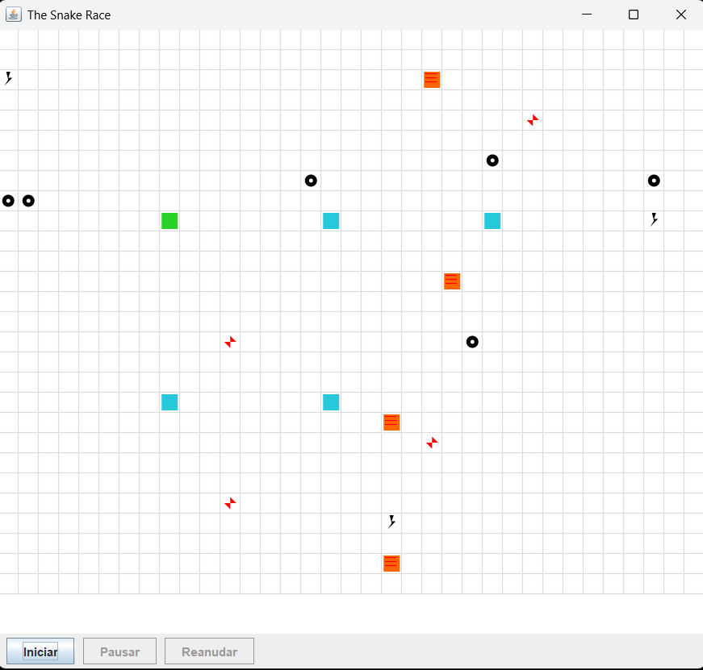

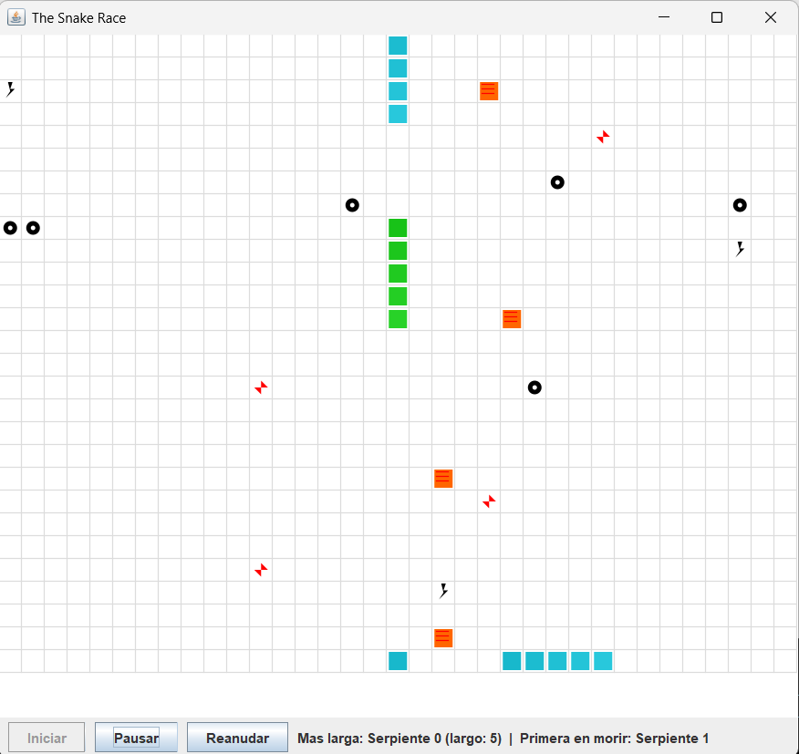

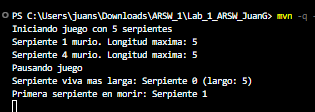

---

## Conclusiones

En este laboratorio se pudo ver en práctica cómo la concurrencia puede causar problemas cuando varios hilos acceden a los mismos datos al mismo tiempo. Con herramientas como synchronized, wait() y notifyAll() es posible coordinar los hilos de manera que el programa funcione correctamente sin que se pisen entre sí. También se aprendió que no todo necesita sincronización, solo las partes donde realmente hay riesgo de conflicto, y que sincronizar de más puede afectar el rendimiento sin ningún beneficio.

---

## Créditos

Base construida por el Ing. Javier Toquica.
Este laboratorio es una adaptación modernizada del ejercicio SnakeRace de ARSW.
